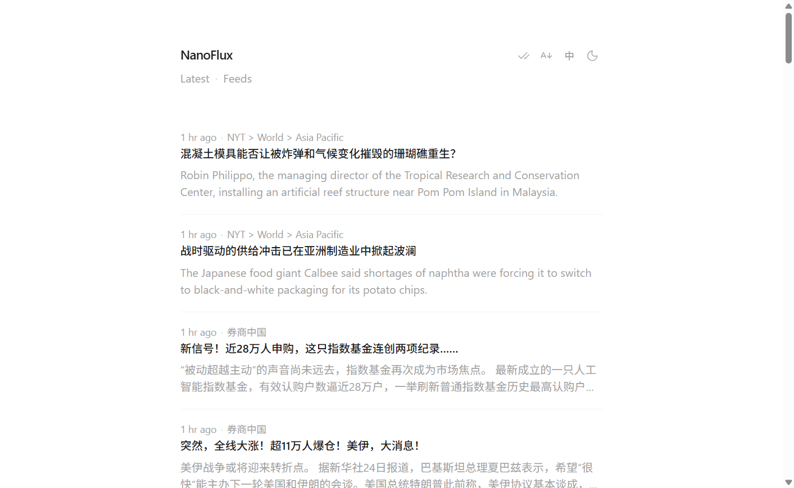

# NanoFlux

A lightweight, self-hosted RSS reader with a minimal web UI, real-time updates, and an MCP server for AI agents. Built on [Bun](https://bun.sh), [Elysia](https://elysiajs.com), and [Svelte 5](https://svelte.dev).



## Features

- **RSS/Atom feeds** — Add, edit, and remove feeds; metadata is auto-fetched from the feed URL.
- **Adaptive polling** — A background scheduler fetches due feeds every minute and adjusts each feed's interval (5–30 min) based on publish frequency and new-item activity.
- **Real-time UI** — New items are pushed to the browser over Server-Sent Events (SSE).
- **Infinite scroll** — Cursor-based pagination for the news timeline.
- **Read tracking** — Mark individual items or all visible items as read.
- **Progressive Web App** — Installable, with a service worker for asset caching.
- **Bilingual UI** — English and Chinese, with theme (light/dark) and font-size toggles.
- **MCP integration** — Exposes tools for feed management, local news queries, and live Google News search so AI clients can interact with your reader.
- **Proxy support** — HTTP and SOCKS proxies for outbound RSS fetches (useful behind firewalls or in restricted networks).
- **Local-first security** — When bound to `127.0.0.1`, API, SSE, and MCP endpoints are restricted to localhost clients.

## Tech Stack

| Layer | Technology |
| --- | --- |
| Runtime | Bun |
| Backend | Elysia, Drizzle ORM |
| Database | SQLite (WAL mode) |
| Frontend | Svelte 5, Tailwind CSS 4, svelte-spa-router |
| Feed parsing | rss-parser |
| AI bridge | Model Context Protocol (MCP) via elysia-mcp |

## Requirements

- [Bun](https://bun.sh) v1.3+

## Quick Start

```bash
# Install dependencies
bun install

# Copy and edit environment variables (optional)
cp .env.example .env

# Build frontend and start the server
bun start
```

Open `http://localhost:3000` in your browser.

### Development

```bash
# Rebuild frontend on file changes
bun run dev:web

# Run backend only (requires a prior build)
bun run start:service
```

### Database

Migrations run automatically on startup. To manage the schema manually:

```bash
bun run db:generate   # Generate migration files
bun run db:push       # Push schema changes
bun run db:studio     # Open Drizzle Studio
```

## Configuration

Create a `.env` file (see `.env.example`):

| Variable | Default | Description |
| --- | --- | --- |
| `PORT` | `3000` | HTTP listen port |
| `HOST` | `127.0.0.1` | Bind address. `127.0.0.1` also restricts API/SSE/MCP to localhost. Use `0.0.0.0` to listen on all interfaces without restriction. |
| `DB_PATH` | `data.sqlite` | SQLite database file path |

### Proxy (optional)

Outbound HTTP requests (RSS fetches, Google News) honor standard proxy environment variables:

| Variable | Description |
| --- | --- |
| `HTTPS_PROXY`, `HTTP_PROXY`, `ALL_PROXY`, `SOCKS_PROXY`, `PROXY_URL` | Proxy URL (supports HTTP and SOCKS) |
| `PROXY_HOST` + `PROXY_PORT` | Alternative host/port form |
| `PROXY_PROTOCOL` | Protocol when using host/port form (default: `socks5h`) |
| `NO_PROXY` | Comma-separated hosts to bypass |

## Windows Service

On Windows, run `install-service.bat` as Administrator to register NanoFlux as an auto-start service (uses [NSSM](https://nssm.cc/) as a wrapper). Logs are written to the `logs/` directory.

## Project Structure

```
├── client/           Svelte frontend source
├── public/           Built static assets (generated)
├── routes/           REST API routes (feeds, items)
├── mcp/              MCP server and tools
├── sse/              Server-Sent Events streaming
├── services/         Feed fetcher, scheduler, HTTP client
├── db/               Drizzle schema and data access
├── shared/           Shared types and utilities
├── drizzle/          SQL migrations
├── main.ts           Application entry point
└── build.ts          Frontend build script
```

## REST API

All endpoints return JSON. When `HOST=127.0.0.1`, these routes are localhost-only.

### Feeds — `/api/feeds`

| Method | Path | Description |
| --- | --- | --- |
| `GET` | `/api/feeds` | List all feeds |
| `GET` | `/api/feeds/meta?url=…` | Preview feed title and description |
| `GET` | `/api/feeds/:id` | Get a feed by ID |
| `POST` | `/api/feeds` | Create a feed |
| `PUT` | `/api/feeds/:id` | Update a feed |
| `DELETE` | `/api/feeds/:id` | Delete a feed and its items |

### Items — `/api/items`

| Method | Path | Description |
| --- | --- | --- |
| `GET` | `/api/items?cursor=&limit=` | Paginated news list (newest first) |
| `POST` | `/api/items/:id/read` | Mark one item as read |
| `POST` | `/api/items/read-all` | Mark all items up to a timestamp as read |

### Real-time — `/sse`

Connect with `EventSource` to receive `items` events when new articles arrive, plus periodic `ping` heartbeats.

## MCP Server

NanoFlux exposes an MCP server at `/mcp` (JSON response mode enabled). Connect your MCP client (e.g. Cursor, Claude Desktop) to use these tools:

| Tool | Description |
| --- | --- |
| `add_feed` | Add an RSS feed (metadata auto-fetched when omitted) |
| `update_feed` | Update feed title, URL, or description |
| `delete_feed` | Remove a feed |
| `search_feeds` | Search feeds by keyword |
| `get_news` | Fetch news in an absolute or relative time range |
| `get_unread_news` | Fetch unread news in a relative time window |
| `search_news` | Keyword search in title/summary within a date range |
| `mark_news_read` | Mark items as read by ID or time range |
| `search_google_news` | Live Google News search (not stored locally) |
| `get_current_time` | Return the server's current UTC time |

## How Feed Fetching Works

1. On startup and every minute (UTC cron), the scheduler loads feeds whose `next_fetched_at` is due.
2. Each feed is fetched over HTTP with a 15 s timeout and parsed as RSS/Atom.
3. New items are deduplicated by `(feed_id, guid)` and inserted into SQLite.
4. Inserted items are broadcast to connected SSE clients.
5. The next fetch interval is adapted: roughly one-third of the median publish gap, clamped to 5–30 minutes, with backoff on errors and tightening when new items appear.

## License

Private project — no license file specified.
