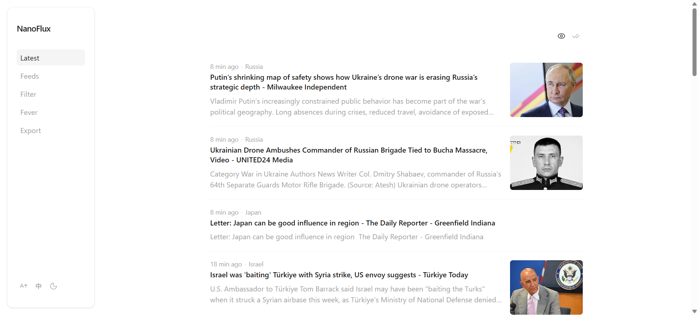

# NanoFlux

**News Service for AI Agents**

NanoFlux is a local news ingestion and query service built for AI agents. It continuously fetches RSS/Atom (and related) sources, extracts article text, optionally scores relevance with an LLM, and exposes the result over **MCP** and a small REST API so agents can subscribe to sources, pull unread news, and manage the filter prompt.

A minimal web UI is included for operators to inspect feeds, tweak the filter, and export data — not as a full-featured RSS reader.

Built on [Bun](https://bun.sh), [Elysia](https://elysiajs.com), and [Svelte 5](https://svelte.dev).



## Table of Contents

- [Why NanoFlux](#why-nanoflux)
- [Features](#features)
- [Tech Stack](#tech-stack)
- [Requirements](#requirements)
- [Quick Start](#quick-start)
- [Development](#development)
- [Configuration](#configuration)
- [Background & Service Mode](#background--service-mode)
- [MCP Integration](#mcp-integration)
- [REST API](#rest-api)
- [How Feed Fetching Works](#how-feed-fetching-works)
- [Project Structure](#project-structure)
- [License](#license)

## Why NanoFlux

Typical RSS readers optimize for human browsing. NanoFlux optimizes for **agent workflows**:

1. **Ingest** — adaptive polling of RSS/Atom, Google News keyword feeds, and WeChat official accounts
2. **Normalize** — GUID dedupe, Google News link resolution, full-text extraction when the feed summary is thin
3. **Filter** — optional single LLM prompt that marks relevant items for agents
4. **Serve** — MCP tools and REST endpoints so agents can fetch news by time window, consume unread items (marking them read), and manage feeds / the filter prompt

Run it on localhost next to your agent runtime; when `HOST=127.0.0.1`, API and MCP accept only local clients.

## Features

**For agents (primary)**

- MCP server at `/mcp` — feed CRUD, keyword / WeChat subscribe, time-ranged news, unread consumption, filter prompt read/write, current time
- REST API with the same data model (`{ code, message, data }` JSON)
- Local-first binding: `HOST=127.0.0.1` restricts API and MCP to localhost
- Persistent SQLite store with cursor pagination so agents can page through large result sets

**News pipeline**

- RSS/Atom feed management with auto-fetched metadata
- Adaptive polling (5–30 min per feed) based on publish frequency
- Full-text article extraction when an RSS summary is too short; Google News article links are resolved to the publisher URL first; HTML is decoded with charset detection (Content-Type, BOM, meta/`<?xml` encoding, with UTF-8 / GB18030 fallback)
- **AI content filter** — a single LLM prompt decides relevance. Empty prompt skips filtering (no LLM call)
- Results stored in `filter_passed` (`null` when filtering is off or the item failed; a non-null string — possibly empty — when it passed, including fail-open pass-through)
- Automatic cleanup of items older than 90 days

**Operator UI (secondary)**

- Minimal web console to verify ingestion, edit the filter prompt, manage feeds, and export Excel
- Home list: **Unread** / **All**; passed items can show an AI reason badge (items that did not pass still appear)
- Feed page (`/feeds`): preview, CRUD, sort, **add by keyword** (Google News RSS for the last 3 days; language inferred from the keyword), **subscribe WeChat 公众号**, **OPML export**
- Filter page (`/filter`) and export page (`/export`) with optional scope (**all** / **passed** / **unmatched** when filtering is enabled)
- PWA shell (installable, offline asset caching; manifest at `/manifest.webmanifest`), bilingual UI (English / Chinese), light/dark theme, adjustable font size

**Networking**

- HTTP and SOCKS proxy support for outbound fetches

## Tech Stack

| Layer | Technology |
| --- | --- |
| Runtime | Bun |
| Backend | Elysia, Drizzle ORM |
| Database | SQLite (WAL mode) |
| Agent bridge | Model Context Protocol (MCP) via elysia-mcp |
| Operator UI | Svelte 5, Tailwind CSS 4 |
| Feed parsing | rss-parser |
| Article extraction | @extractus/article-extractor |
| AI relevance filter | LangChain (`@langchain/openai`) + OpenAI-compatible API |

## Requirements

- [Bun](https://bun.sh) v1.3+

## Quick Start

```bash
# Install dependencies
bun install

# Create the required local configuration (PORT is required)
cp .env.example .env          # macOS / Linux
# copy .env.example .env      # Windows

# Build frontend and start the server
bun start
```

`PORT` is required; the example configuration uses `3000`.

- Agents: point your MCP client at `http://localhost:3000/mcp` (or your configured port)
- Operators: open `http://localhost:3000` in a browser to manage feeds and the filter

### Commands

| Script | Description |
| --- | --- |
| `bun start` | Build frontend and start the server |
| `bun run build:web` | Build frontend assets to `public/` |
| `bun run dev` | Watch frontend and backend together |
| `bun run db:generate` | Generate Drizzle migration files |
| `bun run db:push` | Push schema changes to the database |
| `bun run db:studio` | Open Drizzle Studio |

## Development

```bash
bun run dev
```

This runs the frontend build and the backend together under `bun --watch`. Database migrations run automatically on startup.

## Configuration

Create a `.env` file (see `.env.example`):

| Variable | Default | Description |
| --- | --- | --- |
| `PORT` | `3000` in `.env.example` | HTTP listen port (required; startup fails when omitted) |
| `HOST` | `127.0.0.1` | Bind address. `127.0.0.1` also restricts API/MCP to localhost. Use `0.0.0.0` to listen on all interfaces without restriction. |
| `DB_PATH` | `data.sqlite` | SQLite database file path |

### AI filter (optional)

When `filter.json` has a non-empty `prompt`, new items are scored via LangChain `ChatOpenAI` against an OpenAI-compatible endpoint. Configure these in `.env`:

| Variable | Description |
| --- | --- |
| `LLM_BASE_URL` | API base URL (e.g. `https://api.openai.com`) |
| `LLM_API_KEY` | Bearer token |
| `LLM_MODEL_NAME` | Model ID (e.g. `gpt-4o-mini`) |

If the prompt is empty, filtering is skipped (no LLM call) and items are stored with `filter_passed = null`. If a prompt is set but these variables are missing, or the API fails, items still pass through (`filter_passed` is stored as an empty string).

### WeChat official accounts (optional)

Subscribe to WeChat 公众号 via [WeChat RSS](https://wechatrss.waytomaster.com) (UI, REST, or MCP). Configure these in `.env`:

| Variable | Description |
| --- | --- |
| `WECHATRSS_API_KEY` | WeChat RSS API key |
| `WECHATRSS_API_SECRET` | WeChat RSS API secret |

Without these variables, WeChat search/subscribe endpoints and MCP tools return a configuration error.

### Proxy (optional)

Outbound HTTP requests (RSS fetches, article page scraping, Google News) honor standard proxy environment variables:

| Variable | Description |
| --- | --- |
| `HTTPS_PROXY`, `HTTP_PROXY`, `ALL_PROXY`, `SOCKS_PROXY`, `PROXY_URL` | Proxy URL (supports HTTP and SOCKS) |
| `PROXY_HOST` + `PROXY_PORT` | Alternative host/port form |
| `PROXY_PROTOCOL` | Protocol when using host/port form (default: `socks5h`) |
| `NO_PROXY` | Comma-separated hosts to bypass |

### Content filter (`filter.json`)

The filter is stored in `filter.json` at the project root (created or updated via the UI, REST, or MCP). Loaded on startup.

| Field | Description |
| --- | --- |
| `prompt` | Instructions for the AI relevance filter. Leave empty to skip filtering. |

Example:

```json
{
  "prompt": "Keep only news directly related to asset management regulation, product launches, or institutional fund flows."
}
```

On load, a legacy `filters.json` file (or a multi-filter array in `filter.json`) is migrated to the single-prompt `filter.json` format; the first non-empty `prompt` is kept.

Changes to the filter prompt apply to **newly fetched** items only; existing rows in the database are not re-evaluated.

## Background & Service Mode

Keep NanoFlux running as a long-lived local service next to your agent host.

### One-click start (macOS / Linux / Windows)

| Platform | Start | Stop |
| --- | --- | --- |
| macOS / Linux | `./start.sh` | `./stop.sh` |
| Windows | `start.bat` | `stop.bat` |

These scripts install dependencies if needed, start NanoFlux in the background, and open the browser automatically.

### Auto-start on boot

The install scripts build the frontend once (`bun run build:web`), then register a service that runs `bun run main.ts` (backend only; it does not rebuild on each boot).

**macOS** — register as a user LaunchAgent:

```bash
chmod +x start.sh stop.sh install-service.sh uninstall-service.sh
./install-service.sh   # register
./uninstall-service.sh # remove
```

**Windows** — run `install-service.bat` as Administrator to register an auto-start service (uses [NSSM](https://nssm.cc/) as a wrapper). Run `uninstall-service.bat` to remove it.

Service logs are written to the `logs/` directory on both platforms.

## MCP Integration

NanoFlux exposes an MCP server at `http://localhost:<PORT>/mcp` (JSON response mode enabled; `PORT` from `.env`). This is the primary interface for AI agents.

### Client configuration

Add to your MCP client config (e.g. Cursor or Claude Desktop):

```json
{
  "mcpServers": {
    "nanoflux": {
      "url": "http://localhost:3000/mcp"
    }
  }
}
```

> When `HOST=127.0.0.1`, only localhost clients can reach the MCP endpoint.

### Typical agent loop

1. Ensure sources exist (`add_feed`, `add_feed_by_keyword`, or `add_wechat_feed`)
2. Optionally set relevance criteria with `update_filter_prompt`
3. Call `get_unread_news` (or `get_news`) on a schedule; page with `hasMore` / `nextCursor` until caught up
4. Use returned `title`, `content`, `link`, and `published_at` in your agent workflow

### Available tools

News query tools return stored items from the database. Each item includes `id`, `title`, `link`, `content`, `published_at`, and `feed_title`.

| Tool | Description |
| --- | --- |
| `add_feed` | Add an RSS feed (metadata auto-fetched when omitted) |
| `add_feed_by_keyword` | Create a Google News RSS feed from a keyword only (last 3 days; `hl` inferred from keyword) |
| `add_wechat_feed` | Search by `query` first, then subscribe to one match (pass `fakeid` when multiple). Requires WeChat RSS credentials. |
| `update_feed` | Update feed title, URL, or description |
| `delete_feed` | Remove a feed (also unsubscribes WeChat RSS feeds remotely when configured) |
| `search_feeds` | Search feeds by keyword in title |
| `get_news` | Fetch news in an absolute (`since`/`until`) or relative (`unit`/`count`) time range. Supports `cursor` / `limit` pagination; when `hasMore` is true, call again with `nextCursor` as `cursor` (after a relative query, reuse `resolved_since` / `resolved_until` as `since` / `until`) |
| `get_unread_news` | Fetch unread news in a relative time window (`unit`/`count`). Returned articles are marked as read. When `hasMore` is true, call again with the same `unit`/`count` (and `limit`) until `hasMore` is false |
| `get_filter_prompt` | Get the AI content filter prompt (`prompt`, `enabled`). Empty prompt means filtering is off |
| `update_filter_prompt` | Set the AI filter prompt. Pass an empty string to disable filtering. Applies to newly fetched items only |
| `get_current_time` | Return the server's current UTC time |

Typical WeChat flow for agents: call `add_wechat_feed` with a `query` (it always searches first). If multiple accounts match, call again with the chosen `fakeid`.

## REST API

REST is available for scripts and the operator UI. JSON endpoints return `{ code, message, data }` unless noted otherwise (e.g. OPML / Excel downloads). `code` is `0` on success. When `HOST=127.0.0.1`, these routes are localhost-only.

### Feeds — `/api/feeds`

| Method | Path | Description |
| --- | --- | --- |
| `GET` | `/api/feeds` | Paginated feed list (cursor, limit, keyword, sort) |
| `GET` | `/api/feeds/export.opml` | Download all feeds as OPML 2.0 (`Content-Disposition: nanoflux.opml`) |
| `GET` | `/api/feeds/wechat/accounts?query=` | Search WeChat official accounts |
| `POST` | `/api/feeds/wechat/resolve` | Subscribe remotely and resolve RSS URL (`fakeid`, `nickname`, optional `alias` / `head_img`) |
| `GET` | `/api/feeds/:id` | Get a feed by ID |
| `POST` | `/api/feeds/meta` | Preview feed title and description |
| `POST` | `/api/feeds/create` | Create a feed |
| `POST` | `/api/feeds/:id` | Update a feed |
| `POST` | `/api/feeds/:id/delete` | Delete a feed and its items (also unsubscribes WeChat RSS feeds remotely when configured) |

Query parameters for `GET /api/feeds`:

| Parameter | Description |
| --- | --- |
| `cursor` | Pagination cursor from a previous response |
| `limit` | Page size (default 20, max 50) |
| `keyword` | Search feeds by title |
| `sort` | `updated_desc` (default), `published_desc`, or `published_asc` |

### Items — `/api/items`

| Method | Path | Description |
| --- | --- | --- |
| `GET` | `/api/items?cursor=&limit=` | Paginated news list (newest first) |
| `GET` | `/api/items/export.xlsx` | Download matching items as Excel (`Content-Disposition: nanoflux-export.xlsx`) |
| `POST` | `/api/items/:id/read` | Mark one item as read |
| `POST` | `/api/items/read-all` | Mark all items up to a timestamp as read |

Each item includes `content` (RSS summary or scraped full text) and `filter_passed`:

| `filter_passed` | Meaning |
| --- | --- |
| `null` | Filtering was off, or the AI rejected the item |
| non-null string | Item passed while filtering was enabled (AI reason when present; `""` for fail-open pass-through) |

Query parameters for `GET /api/items`:

| Parameter | Description |
| --- | --- |
| `cursor` | Pagination cursor from a previous response |
| `limit` | Page size (default 20, max 50) |
| `filter_passed` | `1` — items that passed; `0` — items that failed. Only meaningful when a prompt is set; with filtering off, `0` returns no rows |
| `is_read` | `0` or `1` — filter by read state (the UI **Unread** tab uses `is_read=0`) |
| `since`, `until` | Absolute ISO 8601 time bounds |
| `unit`, `count` | Relative window (e.g. `unit=hour&count=2` for the last 2 hours) |

Query parameters for `GET /api/items/export.xlsx`:

| Parameter | Description |
| --- | --- |
| `since`, `until` | Absolute ISO 8601 time bounds (optional) |
| `filter_passed` | Same meaning as for `GET /api/items` |
| `tz_offset` | Client timezone offset in minutes (for formatting published times in the sheet; default `0`) |
| `lang` | Sheet header language: `zh` (default) or `en` |

Exported columns: published time, title, content, and original link.

`POST /api/items/read-all` accepts the same `filter_passed` field in the JSON body to scope bulk mark-read.

### Filter — `/api/filter`

| Method | Path | Description |
| --- | --- | --- |
| `GET` | `/api/filter` | Get the AI filter config (`{ prompt }`) |
| `POST` | `/api/filter` | Update the AI filter prompt (body: `{ prompt }`) |

## How Feed Fetching Works

1. On startup and every minute (UTC cron), the scheduler loads feeds whose `next_fetched_at` is due.
2. Each feed is fetched over HTTP with the `NanoFlux/1.0` user agent (15 s timeout) and parsed as RSS/Atom.
3. Each entry gets a normalized GUID: MD5 hex of the article link (feeds that already provide an MD5 GUID are kept as-is). Per-feed known GUIDs are stored in the `last_guids` column; entries already seen by this feed or already present in the database (global GUID uniqueness) are skipped.
4. For each new entry, Google News article links (`news.google.com/.../articles/...`) are resolved to the publisher URL (embedded token decode, or Google's batchexecute RPC) and the stored `link` is updated when resolution succeeds. If the RSS summary is shorter than ~80 word tokens (counted with `Intl.Segmenter` for Chinese and English — roughly ~200 Chinese characters or ~80 English words), the article page is fetched (desktop browser user agent, 15 s timeout, up to 3 concurrent requests), decoded with charset detection, and parsed with `@extractus/article-extractor` to fill in `content`. Already-known entries skip scraping.
5. New items are deduplicated globally by `guid` (same article from different feeds is stored once), evaluated by the AI filter when a prompt is set (skipped when empty), and inserted into SQLite. On pass, `filter_passed` stores the AI reason (or `""` for fail-open); on fail or when filtering is off, it is `null`.
6. The next fetch interval is adapted: roughly one-third of the median publish gap, clamped to 5–30 minutes, with backoff on errors and tightening when new items appear.
7. Daily at 01:00 UTC, items older than 90 days are deleted.

Agents then consume this store through MCP / REST; they do not scrape feeds themselves.

## Project Structure

```
├── web/              Operator UI (Svelte)
├── public/           Built static assets (generated)
├── routes/           REST API routes (feeds, items, filter)
├── mcp/              MCP server and tools (agent interface)
├── services/
│   ├── ai/           LangChain chat client (OpenAI-compatible)
│   ├── feeds/        Feed fetching, adaptive polling intervals, and OPML export
│   ├── export/       Excel (.xlsx) article export
│   ├── content/      Full-text article extraction
│   ├── filters/      AI relevance filter
│   ├── rss.ts        RSS/Atom HTTP fetch and parse
│   ├── google-news.ts Google News RSS URL helpers and article-link resolution
│   ├── wechat-rss/   WeChat official-account search & subscribe
│   ├── http-fetcher.ts Shared HTTP client (proxy-aware)
│   └── scheduler.ts  Cron-based fetch and cleanup jobs
├── db/               Drizzle schema and data access
├── utils/            Date, hash, HTML, text, and charset-decoding helpers
├── shared/           Shared types and utilities
├── drizzle/          SQL migrations
├── filter.json       AI filter prompt
├── filter.ts         Filter load and persist
├── main.ts           Application entry point
├── dev.ts            Concurrent frontend/backend watch for `bun run dev`
└── build.ts          Frontend build script
```

## License

[MIT](LICENSE)
